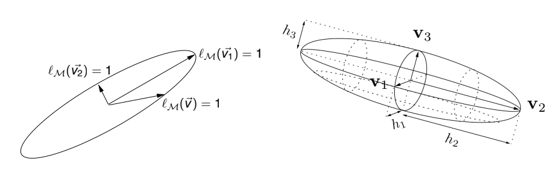
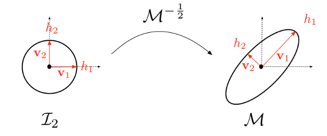

# Metric

## Metric and Euclidean metric space

An **Euclidean metric space** $(\mathbb{R}^d, \mathcal{M})$ is a finite-dimensional vector space where the dot product is defined by means of a symmetric definite positive matrix $\mathcal{M}$:

$$\langle \mathbf{u}, \mathbf{v}\rangle_{\mathcal{M}} = \langle \mathbf{u}, \mathcal{M}\mathbf{v}\rangle = \mathbf{u}^\top\mathcal{M}\mathbf{v}, \text{ for } (\mathbf{u}, \mathbf{v})\in \mathbb{R}^d \times \mathbb{R}^d$$

The properties of $\mathcal{M}$ ensure that it defines a dot product. We will now refer to $\mathcal{M}$ as a metric tensor or metric.

### Canonical Euclidean metric space $(\mathbb{R}^3, \mathcal{I}_3)$

The most familiar example of Euclidean space is the one defined by an identity matrix. The 2D canonical one is defined by the 2x2 identity matrix $\mathcal{I}_2$ and the 3D by the 3x3 identity matrix $\mathcal{I}_3$.

### Geometric definitions in Euclidean spaces

The dot product defined by $\mathcal{M}$ allows to define the distance notion in $\mathbb{R}^d$. In the following $d$ denotes the dimension and is equal either to 2 or 3. We can then define norm and distance definitions:

* $\forall \mathbf{u}\in\mathbb{R}^d, \quad ||\mathbf{u}||_{\mathcal{M}}=\sqrt{\langle\mathbf{u},\mathcal{M}\mathbf{u}\rangle}$
* $\forall (\mathbf{a},\mathbf{b})\in\mathbb{R}^d \times \mathbb{R}^d, \quad d_{\mathcal{M}}(\mathbf{a},\mathbf{b})=||\mathbf{b}-\mathbf{a}||_{\mathcal{M}}=||\mathbf{a}\mathbf{b}||_{\mathcal{M}}$

The length $l_{\mathcal{M}}$ of a segment $\mathbf{a}\mathbf{b}=[\mathbf{a},\mathbf{b}]$ is then given by the distance between its extremities:

$$l_{\mathcal{M}}(\mathbf{a}\mathbf{b}) = d_{\mathcal{M}}(\mathbf{a},\mathbf{b})=||\mathbf{a}\mathbf{b}||_{\mathcal{M}}$$

Moreover, given a bounded subset $K$ of $\mathbb{R}^d$, the volume $|K|_{\mathcal{M}}$ is given by:

$$|K|_{\mathcal{M}} = \int_K\sqrt{\det\mathcal{M}}d\mathbf{x} = \sqrt{\det\mathcal{M}}|K|_{\mathcal{I}_d}$$

where $|K|_{\mathcal{I}_d}$ is the Euclidean volume of $K$.

Finally, as metric tensor $\mathcal{M}$ is symmetric, it is diagonalizable. It thus admits the following spectral decomposition:

$$\mathcal{M} = \mathcal{R} \Lambda \mathcal{R}^{\top}$$

where $\mathcal{R}$ is an orthonormal matrix composed of the eigenvectors $(\mathbf{v_i})_{i=1,d}$ of $\mathcal{M}$:

$$\mathcal{R}=(\mathbf{v_1} \quad \dots \quad \mathbf{v_d})$$

verifying $\mathcal{R}\mathcal{R}^{\top} = \mathcal{R}^{\top}\mathcal{R} = \mathcal{I}_d$. $\Lambda=\text{diag}(\lambda_i)$ is a diagonal matrix composed of the eigenvalues of $\mathcal{M}$, denoted $(\lambda_i)_{i=1,d}$, which are strictly positive.

---

## Natural metric mapping

The metric $\mathcal{M}$ can be seen as a mapping from the unit ball $\mathcal{B}_{\mathcal{I}_d}$ of identity matrix $\mathcal{I}_d$ onto the unit ball $\mathcal{B}_{\mathcal{M}}$ of $\mathcal{M}$, where these unit balls are defined as:

$$
\begin{aligned}
    \mathcal{B}_{\mathcal{I}_d} &= \left\{ \mathbf{x} \in \mathcal{V}(\mathbf{a}) \mid (\mathbf{x}-\mathbf{a})^{\top}\mathcal{I}_d(\mathbf{x}-\mathbf{a})=1\right\} \\
    \mathcal{B}_{\mathcal{M}} &= \{ \mathbf{x} \in \mathcal{V}(\mathbf{a}) \mid (\mathbf{x}-\mathbf{a})^{\top}{\mathcal{M}}(\mathbf{x}-\mathbf{a})=1\}
\end{aligned}
$$

Where $\mathcal{V}(\mathbf{a})$ denotes the vicinity of point $\mathbf{a}$. A visual representation of these unit balls is given in Figure 1. Notice that $\mathcal{B}_{\mathcal{I}_d}$ defines the unit circle in 2D and the unit sphere in 3D.

> **Figure 1:** *Geometric interpretation of the unit ball $\mathcal{B}_{\mathcal{M}}$ of $\mathcal{M}$. $\mathbf{v}_i$ are the eigenvectors of $\mathcal{M}$ and $\lambda_i=h_i^{-2}$ are the eigenvalues of $\mathcal{M}$. (Loseille 2011)*

$\mathcal{M}^{-\frac{1}{2}}$ is defined by the spectral decomposition:

$$\mathcal{M}^{-\frac{1}{2}}=\mathcal{R}\Lambda^{-\frac{1}{2}}\mathcal{R}^{\top} \quad \text{where} \quad \Lambda^{-\frac{1}{2}} = \text{diag}(\lambda_i^{-\frac{1}{2}})$$

Where $\text{diag}$ denotes a 2D or 3D diagonal matrix. $\Lambda^{-\frac{1}{2}}$ defines the diagonal matrix of the sizes $h_i$ along directions as $h_i = \lambda_i^{-\frac{1}{2}}$. This gives the relation between the metric $\mathcal{M}$ and the size it enforces.

The mapping defined above is written in the form of the following application:

$$
\begin{aligned}
    \mathcal{M}^{-\frac{1}{2}} : \mathbb{R}^d &\longmapsto \mathbb{R}^d \\
    \mathbf{x} &\longrightarrow \mathcal{M}^{-\frac{1}{2}}\mathbf{x}
\end{aligned}
$$

> **Figure 2:** *Natural mapping associated with metric $\mathcal{M}$. (Loseille 2008)*

for more details, see A. Loseille and F. Alauzet, *Continuous mesh framework. Part I: well-posed continuous interpolation error*, SIAM J. Numer. Anal., Vol. 49, Issue 1, pp. 38-60, 2011. [PDF](https://pages.saclay.inria.fr/frederic.alauzet/download/Loseille_Continuous%20mesh%20framework%20part%20I%20Well-posed%20continuous%20interpolation%20error.pdf)

