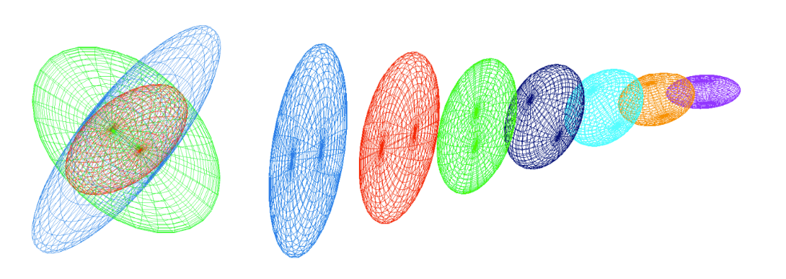

# Metric operations

Building a metric that is suitable for remeshing may require [combining information from different sources](#metric-intersection) or imposing constraints (e.g. [minimum or maximum edge lengths](#thresholds-on-the-local-sizes), [smooth variation](#controling-the-step-between-two-metrics) with respect to [the input mesh](#element-implied-metric), ... ). 

## Metric Interpolation

In practice, depending on the CFD solver, the metric is either stored on the vertex or the cell center. The definition of an interpolation procedure on metrics is therefore mandatory to be able to compute the metric at any point of the domain. When more than two discrete metrics needs to be interpolated, it is important to use a consistent interpolation framework. For instance, the interpolation needs to be commutative (i.e. the resulting metric does not depend on the order of the interpolation operations between metrics). To that end, the log-Euclidean framework introduced by Arsigny et al. (2006) is used.

### Log-Euclidean framework

The authors first define the notion of metric logarithm and matrix exponential. The **metric logarithm** is defined on the set of metric tensors. For metric tensor $\mathcal{M}=\mathcal{R}\Lambda\mathcal{R}^{\top}$, it is given by:

$$
\ln(\mathcal{M}):=\mathcal{R}\ln(\Lambda)\mathcal{R}^{\top}
$$

where $\ln(\Lambda) = \text{diag}(\ln(\lambda_i))$. The **matrix exponential** is defined on the set of symmetric matrices. For any symmetric matrix $S=\mathcal{Q}\Sigma\mathcal{Q}^{\top}$, it is given by:

$$
\exp(S):= \mathcal{Q}\exp(\Sigma)\mathcal{Q}^{\top}
$$

where $\exp(\Sigma)=\text{diag}(\exp(\xi_i))$. We can now define the **logarithmic addition** $\oplus$ and the **logarithmic scalar multiplication** $\odot$:

$$
\mathcal{M}_1 \oplus \mathcal{M}_2 := \exp(\ln(\mathcal{M}_1)+\ln(\mathcal{M}_2))
$$

$$
\alpha \odot \mathcal{M}:=\exp(\alpha\cdot\ln(\mathcal{M}))=\mathcal{M}^{\alpha}
$$

The logarithmic addition is commutative and coincides with matrix multiplication whenever the two tensors $\mathcal{M}_1$ and $\mathcal{M}_2$ commute in the matrix sense.

### Metric interpolation in the log-Euclidean framework

Let $(\mathbf{x}_i)_{i=1,...k}$ be a set of cell centers and $(\mathcal{M}(\mathbf{x}_i))_{i=1,...k}$ their associated metrics. Then, for a point $\mathbf{x}$ of the domain such that:

$$
\mathbf{x}=\sum_{i=1}^k\alpha_i\cdot\mathbf{x}_i \text{ with } \sum_{i=1}^k\alpha_i=1
$$

the interpolated metric is defined by:

$$
\mathcal{M}(\mathbf{x})=\bigoplus_{i=1}^k\alpha_i\odot\mathcal{M}(\mathbf{x}_i)=\exp\left(\sum_{i=1}^k \alpha_i \ln(\mathcal{M}(\mathbf{x}_i)) \right)
$$

This interpolation is commutative, but its bottleneck is to perform $k$ diagonalizations and to request the use of the logarithm and the exponential functions which are CPU consuming. However, this procedure is essential to define continuously the metric map on the entire domain. Also, since CODA is a cell centered solver and Tucanos is vertex based, this interpolation definition is crucial to get the metric field at the vertexes of the mesh. Moreover, it has been demonstrated (Arsigny et al., 2006) that this interpolation preserves the maximum principle, i.e., for an edge $\mathbf{ab}$ with endpoint metrics $\mathcal{M}(\mathbf{a})$ and $\mathcal{M}(\mathbf{b})$ such that $\text{det}(\mathcal{M}(\mathbf{a}))<\text{det}(\mathcal{M}(\mathbf{b}))$ then we have:

$$
\text{det}(\mathcal{M}(\mathbf{a}))< \text{det}(\mathcal{M}(\mathbf{a}+t\mathbf{ab}))<\text{det}(\mathcal{M}(\mathbf{b})), \quad \forall t\in[0,1]
$$

## Metric Intersection

In metric-based adaptation, the metric field computed from the error estimation does not take into account geometric or gradation constraints, that would be defined using different metric fields. **Metric intersection** is used to get a unique metric field. It consists in keeping the most restrictive size constraint in all directions imposed by this set of metrics.

> **Figure 1:** *Left, view illustrating the metric intersection procedure with the simultaneous reduction in three dimensions. In red, the resulting metric of the intersection of the blue and green metrics. Right, metric interpolation along a segment where the endpoints metrics are the blue and violet ones. (Loseille 2008)*

Formally speaking, let $\mathcal{M}_1$ and $\mathcal{M}_2$ be two metric tensors given at a point. The metric tensor $\mathcal{M}_{1\cap2}$ corresponding to the intersection of $\mathcal{M}_1$ and $\mathcal{M}_2$ is the one prescribing the largest possible size under the constraint that the size in each direction is always smaller than the sizes prescribed by $\mathcal{M}_1$ and $\mathcal{M}_2$. Let us give a geometric interpretation of this operator. Metric tensors are geometrically represented by an ellipse in 2D and an ellipsoid in 3D. But the intersection between two metrics is not directly the intersection between two ellipsoids as their geometric intersection is not an ellipsoid. Therefore, we seek for the largest ellipsoid representing $\mathcal{M}_{1\cap2}$ included in the geometric intersection of the ellipsoids associated with $\mathcal{M}_1$ and $\mathcal{M}_2$, cf. the Figure above (left). The ellipsoid (metric) verifying this property is obtained by using the simultaneous reduction of two metrics.

### Simultaneous reduction

The simultaneous reduction enables to find a common basis $(\mathbf{e}_1, \mathbf{e}_2, \mathbf{e}_3)$ such that $\mathcal{M}_1$ and $\mathcal{M}_2$ are congruent to a diagonal matrix in this basis, and then to deduce the intersected metric. To do so, the matrix $\mathcal{N}=\mathcal{M}_1^{-1}\mathcal{M}_2$ is introduced. $\mathcal{N}$ is diagonalizable with real-eigenvalues. The normalized eigenvectors of $\mathcal{N}$ denoted by $\mathbf{e}_1$, $\mathbf{e}_2$ and $\mathbf{e}_3$ constitute a common diagonalization basis for $\mathcal{M}_1$ and $\mathcal{M}_2$. The entries of the diagonal matrices, that are associated with the metrics $\mathcal{M}_1$ and $\mathcal{M}_2$ in this basis, are obtained with the Rayleigh formula:

$$
\lambda_i=\mathbf{e}_i^{\top}\mathcal{M}_1\mathbf{e}_i \text{ and } \mu_i=\mathbf{e}_i^{\top}\mathcal{M}_2\mathbf{e}_i
$$

**Remark:** $\lambda_i$ and $\mu_i$ are not the eigenvalues of $\mathcal{M}_1$ and $\mathcal{M}_2$. They are the spectral values associated with basis $(\mathbf{e}_1, \mathbf{e}_2, \mathbf{e}_3)$.

Let $\mathcal{P}=(\mathbf{e}_1 \mathbf{e}_2 \mathbf{e}_3)$ be the matrix with the columns that are the eigenvectors $\{\mathbf{e}_i\}_{i=1...3}$ of $\mathcal{N}$. $\mathcal{P}$ is invertible as $(\mathbf{e}_1, \mathbf{e}_2, \mathbf{e}_3)$ is a basis of $\mathbb{R}^3$. We have:

$$
\mathcal{M}_1=\mathcal{P}^{-\top}\begin{pmatrix} \lambda_1 & 0 & 0 \\ 0 & \lambda_2 & 0 \\ 0 & 0 & \lambda_3 \end{pmatrix} \mathcal{P}^{-1} \text{ and } \mathcal{M}_2=\mathcal{P}^{-\top}\begin{pmatrix} \mu_1 & 0 & 0 \\ 0 & \mu_2 & 0 \\ 0 & 0 & \mu_3 \end{pmatrix} \mathcal{P}^{-1} 
$$

### Computing the metric intersection

The resulting intersected metric $\mathcal{M}_{1\cap2}$ is then analytically given by:

$$
\mathcal{M}_{1\cap2}=\mathcal{M}_1\cap\mathcal{M}_2=\mathcal{P}^{-\top}\begin{pmatrix} \max(\lambda_1,\mu_1) & 0 & 0 \\ 0 & \max(\lambda_2,\mu_2) & 0 \\ 0 & 0 & \max(\lambda_3,\mu_3) \end{pmatrix} \mathcal{P}^{-1}
$$

The ellipsoid associated with $\mathcal{M}_{1\cap2}$ is the largest ellipsoid included in the geometric intersection region of the ellipsoids associated with $\mathcal{M}_1$ and $\mathcal{M}_2$.

Numerically, to compute $\mathcal{M}_{1\cap2}$, the real-eigenvalues of $\mathcal{N}$ are first evaluated with a Newton algorithm. Then, the eigenvectors of $\mathcal{N}$, which define $\mathcal{P}$, are computed using the algebra notions of image and kernel spaces.

See [proof](#maths)

## Metric gradation

Metric fields may have huge variations or may be quite irregular when evaluated from numerical solutions that present discontinuities or steep gradients. This makes the generation of a unit mesh difficult or impossible, thus leading to poor quality anisotropic meshes. Generating high-quality anisotropic meshes requires to smooth the metric field by bounding its variations in all directions. It also helps with the convergence of the implicit solver. **Mesh gradation** (Alauzet, 2010) consists in reducing in all directions the size prescribed at any points if the variation of the metric field is larger than a fixed threshold.

### Spanning a metric field

Let $\mathbf{p}$ be a point of a domain $\Omega$ supplied with a metric $\mathcal{M}_\mathbf{p}$ and $\beta$ the specified gradation. Two laws governing the metric growth in the domain are proposed. In the first one, the metric growth is homogeneous in the Euclidean metric field defined by $\mathcal{M}_\mathbf{p}$. The second metric growth is homogeneous in the physical space, i.e., the classical Euclidean space.

The first law associates for any point $\mathbf{x}$ of the domain a unique scale factor with the metric given by:

$$
\eta^2(\mathbf{px})=(1+l_p(\mathbf{px})\cdot\ln(\beta))^{-2}=(1+\sqrt{\mathbf{px}^{\top} \mathcal{M}_\mathbf{p} \mathbf{px}}\cdot\ln(\beta))^{-2}
$$

With this formulation, each pointwise metric $\mathcal{M}_\mathbf{p}$ spans a global continuous smooth metric field all over domain $\Omega$ parametrized by the given gradation value $\beta$:

$$
(\mathcal{M}_{\mathbf{p}}(\mathbf{x}))_{\mathbf{x}\in\Omega} \quad \text{with } \mathcal{M}_{\mathbf{p}}(\mathbf{x})=\eta^2(\mathbf{px})\mathcal{M}_\mathbf{p}
$$

In this case, the resulting metric field grows homogeneously in the Euclidean metric space defined by $\mathcal{M}_{\mathbf{p}}$ as the scale factor depends on the length of segment $\mathbf{px}$ with respect to $\mathcal{M}_{\mathbf{p}}$. As a result, the shape of the metric is kept unchanged while growing. This law conserves the same anisotropic ratio.

For the second law, we associate independently a growth factor with each eigenvalue of $\mathcal{M}_{\mathbf{p}}=\mathcal{R}\Lambda\mathcal{R}^{\top}$, with $\Lambda=\text{diag}(\lambda_i)_{i=1,3}$:

$$
\eta_i^2(\mathbf{px})=(1+\sqrt{\lambda_i}||\mathbf{px}||_2\cdot\ln(\beta))^{-2}
$$

the grown metric at $\mathbf{x}$ is given by:

$$
\mathcal{M}_{\mathbf{p}}(\mathbf{x})=\mathcal{R}\mathcal{N}(\mathbf{px})\Lambda\mathcal{R}^{\top} \quad \text{where } \mathcal{N}(\mathbf{px})= \begin{pmatrix} \eta_1^2(\mathbf{px}) & 0 & 0 \\ 0 & \eta_2^2(\mathbf{px}) & 0 \\ 0 & 0 & \eta_3^2(\mathbf{px}) \end{pmatrix}
$$

The resulting metric field grows homogeneously in the physical space. Indeed, each eigenvalue grows similarly in all directions, as the factor $\eta_i$ depends only on the distance (in the physical space) from the original point. Consequently, the shape, i.e., the anisotropic ratio of the metric, is no more preserved as the eigenvalues are growing separately and differently. This law gradually makes the metric more and more isotropic as it gradually propagates in the domain.

Alauzet et al. (2021) suggest to mix these two laws to achieve an efficient metric gradation algorithm. For this new law, a growth factor is associated independently with each eigenvalue of $\mathcal{M}_{\mathbf{p}}$:

$$
\eta_i^2(\mathbf{px})=((1+\sqrt{\lambda_i}||\mathbf{px}||_2\cdot\ln(\beta))^t(1+l_p(\mathbf{px})\cdot\ln(\beta))^{1-t})^{-2}
$$

The authors consider $t=\frac{1}{8}$ within their numerical examples. For the applications in the work, we will use $t=1.$

### Metric reduction

The reduced metric at a point $\mathbf{x}$ of the domain $\Omega$ is given by the strongest size constraint imposed by the metric at $\mathbf{x}$ and by the spanned metrics (parametrized by the given size gradation) of all the other points of the domain at $\mathbf{x}$:

$$
\widetilde{\mathcal{M}(\mathbf{x})} = \left(\bigcap_{\mathbf{p}\in\Omega}\mathcal{M}_{\mathbf{p}}(\mathbf{x})\right)\cap \mathcal{M}(\mathbf{x})
$$

Practical implementation are given in Alauzet (2010).

## Thresholds on the local sizes

In order to ensure that the metric field will generate meshes with edge sizes between $h_{min}$ and $h_{max}$, the metric $\mathcal M = R^T diag(s_1, \cdots s_d) R$ with $R = (\mathbf v_1| \cdots | \mathbf v_d)$ is modified as
$$\mathcal T(\mathcal M, h_{min}, h_{max}) = R^T diag(\tilde s_1, \cdots \tilde s_d) R$$
with $\tilde s_i = \min\left(\max\left(s_i, \frac{1}{h_{max}^2}\right), \frac{1}{h_{min}^2}\right)$.

## Element-implied metric

Given an element $K$, defined by its vertices $(\mathbf x_0 , \cdots , \mathbf x_d )$, the element-implied metric is the metric for which the element is equilateral

If $J_{K, \Delta}$ is the jacobian of the transformation from the reference equilateral element to the physical element, the element-implied metric is 
$$\mathcal M_K = (J_{K, \Delta} J_{K, \Delta}^T)^{-1}$$

In practice $J_{K, \Delta}$ is computed as $J_{K, \Delta} = J_{K, \perp} J_{\perp, \Delta}$ where
    - $J_{K, \perp} = (\mathbf x_1 - \mathbf x_0 | \cdots | \mathbf x_d - \mathbf x_0)$ is the jacobian of transformation from the reference orthogonal element to the physical element
    - $J_{\perp, \Delta}$ is the jacobian of transformation from the reference equilateral element to the reference orthogonal element (independent of $K$ )

## Controlling the step between two metrics

In the remeshing process, it may be interesting to control the step between the element-implied and target metrics. Such control is available within the remesher **Tucanos** and specified by the parameter $f$.

Given two metric fields $\mathcal{M}_1$ and $\mathcal{M}_2$, the objective is to find $\mathcal{M} = \mathcal{L}(\mathcal{M}_1, \mathcal{M}_2, f)$ *as close as possible* from $\mathcal{M}_2$ such that, for all edges $e$:

$$
\frac{1}{f} \le \sqrt{\frac{e^T \mathcal{M} e}{e^T \mathcal{M}_1 e}} \le f
$$

i.e. to have:

$$
\frac{1}{f} \le \lambda_{\min}(\mathcal{M}_1^{-\frac{1}{2}}\mathcal{M} \mathcal{M}_1^{-\frac{1}{2}}) \le \lambda_{\max}(\mathcal{M}_1^{-\frac{1}{2}}\mathcal{M} \mathcal{M}_1^{-\frac{1}{2}}) \le f
$$

Practically, we define *as close as possible* as minimizing the Froebenius norm $\|\mathcal{M}_1^{-\frac{1}{2}} (\mathcal{M} - \mathcal{M}_2) \mathcal{M}_1^{-\frac{1}{2}}\|_F$. The optimal $\mathcal{M}$ is then computed as follows:

  * compute $\mathcal{N} := \mathcal{M}_1^{-\frac{1}{2}} \mathcal{M}_2 \mathcal{M}_1^{-\frac{1}{2}}$,
  * compute the eigenvalue decomposition $Q D Q^T = \mathcal{N}$, with $D=\text{diag}(\lambda_i)$
  * compute $\mathcal{N}^\ast := Q \text{diag}(\hat\lambda_i) Q^T$ where $\hat\lambda_i := \min(\max(\lambda_i, \frac{1}{f} ), f )$,
  * compute $\mathcal{M}^\ast := \mathcal{M}_1^{\frac{1}{2}} \mathcal{N}^\ast \mathcal{M}_1^{\frac{1}{2}}$.

> **Figure 2:** *Representation of the controlled metric $\mathcal{L}(\mathcal{M}_1, \mathcal{M}_2, f)$ by stepping with stepping parameter $f=2$. The thin blue lines represent $2\mathcal{M}_1$ and $\frac{1}{2} \mathcal{M}_1$, X. Garnaud*

See [proof](#maths)

## Metric scaling

- The "ideal" metric $\mathcal M$ is modified using a series of constraints
  - Minimum and maximum edge sizes $h_{min}$ and $h_{max}$,
  - Maximum gradation $\beta$,
  - Maximum step $f$ with respect to the element implied metric $\mathcal M_i$,
  - A minimum curvature radius to edge lenth ratio $r$ (and optionally $y^+_{target}$), giving a fixed metric $\mathcal M_f$
- A scaling $\alpha$ is applied, such that the actual metric used for remeshing is 
$$ \widetilde{\mathcal M} = \mathcal L(\mathcal T(\alpha \mathcal M, h_{min}, h_{max}) \cap \mathcal M_f, \mathcal M_i, f) $$
- $\alpha$ is chosen to have a given complexity
$$ \mathcal C ( \widetilde{\mathcal M})= \mathcal N$$
- A simple bisection is used to compute $\alpha$ if all the constraints can be met.

##  Maths

### Notations
- One denotes the Frobenius norm of a matrix $A \in \mathbb R^{n\times n}$ by 
$\| A \|_F := \mathrm{tr}(A^TA)^{1/2} = (\sum_{i,j} A_{i,j}^{\,2})^{1/2}$. This norm is associated with the scalar product $(A, B)_F := \mathrm{tr}(A^T B)$.
- One denotes by $\leq$ the partial order in the symmetric matrices space $\mathcal S_n(\mathbb R)$: $S_1 \leq S_2$ if $S_2 - S_1 \in \mathcal S_n^+(\mathbb R)$, i.e. for all $x \in \mathbb R^n$, $x^T S_1 x \leq x^T S_2 x$.

### Projection on a closed convex subset of the symmetric matrices

The following theorem has been proven in *Computing a nearest symmetric positive semidefinite matrix*, Higham Nicholas J, 1988:

>**Theorem 1** Let $\mathcal S_\delta := \{ S \in \mathcal S_n(\mathbb R^n) : \delta I_n \leq S \}$. Then, $\mathcal S_\delta$ is a closed convex subset of the space $\mathcal S_n(\mathbb R^n)$ and then there exists a projection application $P_\delta : \mathcal S_n(\mathbb R^n) \rightarrow \mathcal S_\delta$ such that 
> $$\forall A \in \mathcal S_n(\mathbb R), \quad 
    \| A - P_\delta (A) \|_F 
    =
    \inf \big\{  \| A - S \|_F \: : \: S \in \mathcal S_\delta \big\}
    .
> $$
>Let $A \in \mathcal S_n(\mathbb R)$ and $A = Q^T D Q$ its diagonalisation in an orthonormal basis: $Q \in \mathcal O_n(\mathbb R)$, $D = \mathrm{diag}(\lambda_i)$. Then, 
> $$P_\delta(A) = Q \hat{D} Q^T, 
    \quad \text{where} \enspace 
    \hat{D} := \mathrm{diag}(\mathrm{max}(\lambda_i, \delta))
    .
$$

#### Proof

Let $A \in \mathcal S_n(\mathbb R)$ and its diagonalisation in a orthonomal basis $P^T A P = D = \mathrm{diag}(\lambda_i)$.
As $\| . \|_F$ is invariant by linear isometry ($\| P A Q \|_F^2 = \mathrm{tr}((PAQ)^T PAQ) = \mathrm{tr}(Q^T A^T P^TPAQ) = \mathrm{tr}(QQ^TA^TA) = \| A \|_F^2$, one gets $\| A - S \|_F^2 = \| D - Q^T S Q\|_F^2$ and then the change of variable $S \in \mathcal S_n(\mathbb R) \mapsto X = Q^T S Q \in \mathcal S_n(\mathbb R)$ together with $\delta I \leq S \Leftrightarrow \delta I \leq Q^T S Q$, leads to the following problem 
$$
    \inf \big\{ \| D - X \|_F^2 : X \in \mathcal S_n(\mathbb R), \, \delta I \leq X \big\}
.
$$
This problem can be computed explicitly. Since $X_{ii} = e_i^T X e_i \geq \delta e_i^T e_i = \delta$, ($e_i = (\delta_{ij})_j$ the canonical basis vectors)
$$
    \| D - X \|_F^2 
    =
    \sum_{i=1}^n (\lambda_i - X_{ii})^2 + 2 \sum_{i < j} X_{ij}^2
    \geq \sum_{i=1}^n (\lambda_i - X_{ii})^2
    \geq \sum_{i : \lambda_i < \delta} (\lambda_i - \delta)^2
    .
$$
This lower bound is reached for the following diagonal matrix $X := \hat{D} := \mathrm{diag}(\hat{\lambda}_i)$, where $\hat\lambda_i := \max(\lambda_i, \delta)$, and moreover, $\hat{D} \geq \delta I$ and is in $\mathcal S_n(\mathbb R)$, which ends the proof.

### Generalization

One can generalize the Theorem above as follow:

>**Theorem 2** Given two symmetric real numbers $0 < \alpha < \beta$, let $\mathcal S_{\alpha, \beta}:= \{ S \in \mathcal S_n(\mathbb R) : \alpha I_n \leq S \leq \beta I_n \}$. $\mathcal S_{\alpha, \beta}$ is a compact convex subset of $\mathcal S_n(\mathbb R)$ and then let us denote $P_{\alpha, \beta} : \mathcal S_n(\mathbb R) \rightarrow \mathcal S_{\alpha, \beta}$ the associated projection application:
> $$
    \forall A \in \mathcal S_n(\mathbb R), \quad 
    \| A - P_{\alpha, \beta} (A) \|_F 
    =
    \inf \big\{  \| A - S \|_F \: : \: S \in \mathcal S_{\alpha, \beta} \big\}
    .
> $$
> Given $A \in \mathcal S_n(\mathbb R)$ and $A = Q D Q^T$ its diagonalisation in an orthonormal basis: $Q \in \mathcal O_n(\mathbb R)$, $D = \mathrm{diag}(\lambda_i)$. Then, 
> $$
    P_{\alpha, \beta}(A) = Q \hat{D} Q^T, 
    \quad \text{where} \enspace 
    \hat{D} 
    := 
    \mathrm{diag}(\hat{\lambda}_i), \enspace 
    \hat{\lambda}_i 
    := 
    \mathrm{min}\big(\mathrm{max}\big(\lambda_i, \alpha \big), \beta\big)
    .
$$

#### Proof
The proof follows the one above very closely.
The lower bound is got using the inequality: $\alpha e_i^T I_n e_i \leq e_i^T X e_i \leq \beta e_i^T I_n e_i \Rightarrow \alpha \leq X_{ii} \leq \beta$:
$$
    \| D - X \|_F^2 
    \geq
    \sum_{i = 1}^n (\lambda_i - X_{ii})^2 
    + 2\, \sum_{i < j} X_{ij}^2
$$
$$
    \geq \sum_{i = 1}^n (\lambda_i - X_{ii})^2
$$
$$
    \geq 
    \sum_{i : \lambda_i < \alpha} (\lambda_i - \alpha)^2
    + 
    \sum_{i : \lambda_i > \beta} (\lambda_i - \beta)^2
    ,
$$
which is reached for $\hat D := \mathrm{diag}(\hat\lambda_i)$ where $\hat \lambda_i = \alpha$ if $\lambda_i < \alpha$, $\hat\lambda_i = \beta$ if $\lambda_i > \beta$ and otherwise $\hat\lambda_i = \lambda_i$.
Again, the matrix $\hat D$ is symmetric and indeed in $\mathcal S_{\alpha, \beta}$ (because since $\hat D$ is diagonal, $\alpha \leq \hat\lambda_i \leq \beta \Leftrightarrow \alpha I_n \leq \hat D \leq \beta I_n$) and thus is the unique solution of the problem (existence and uniqueness being given by the projection on closed convex sets in a Hilbert space).

### Metric optimization problem

Given two metrics $\mathcal M_1, \mathcal M_2 \in \mathcal S_n^{++}(\mathbb R)$.
The deformation ratio between a metric $\mathcal M \in S_n^{++}(\mathbb R)$ and $\mathcal M_0$ is defined as a function of $x \in \mathbb R^n \backslash \{0 \}$
$$
    r(\mathcal M, \mathcal M_0; x)
    :=
    \left( \frac{x^T \mathcal M x}{ x^T \mathcal M_0 x} \right)^{1/2}
    .
$$

#### The problem.

Given two metrics $\mathcal M_1, \mathcal M_2 \in \mathcal S_n^{++}(\mathbb R)$, and two real numbers $0 < \alpha < \beta$, let $\mathcal R_{\alpha, \beta}(\mathcal M_0)$ be the set of metrics which are not to stretched with regard to $\mathcal M_0$: 
$$
    \mathcal R_{\alpha , \beta} (\mathcal M_0)
    := 
    \big\{ 
        \mathcal M \in \mathcal S_n(\mathbb R) : 
        \forall x \in \mathbb R^n \backslash \{0\}, \,
        \alpha \leq r(\mathcal M, \mathcal M_0; x)^2 \leq \beta 
    \big\}
.
$$
Again, this set is compact and convex.
Given a matrix norm $||| . |||$, we want to find $\mathcal M^\ast \in \mathcal R_{\alpha, \beta}(\mathcal M_0)$ which minimize the distance to $\mathcal M_1$, i.e. find $\mathcal M^\ast \in \mathcal R_{\alpha, \beta}(\mathcal M_0)$ such that:
$$||| \mathcal M_1 - \mathcal M^\ast||| 
    =
    \inf \big\{  
        ||| \mathcal M_1 - \mathcal M||| : 
        \mathcal M \in \mathcal R_{\alpha, \beta}(\mathcal M_0)
    \big\}
$$

> **Lemma** : 
> Let $\mathcal M, \mathcal M_0 \in \mathcal S_n^{++}(\mathbb R)$ two metrics > and $\alpha, \beta \in \mathbb R$. The function $x \in \mathbb R^n \backslash \{ 0 \} \mapsto r(\mathcal M, \mathcal M_0; x)^2$ is bounded and reaches its bounds which are the minimum and maximum of the eigenvalues of $\mathcal M_0^> {-1/2} \mathcal M \mathcal M_0^{-1/2}$. Thus, 
> $$
> \forall x \in \mathbb R^n \backslash \{0 \}, \enspace
> \alpha \leq r(\mathcal M, \mathcal M_0; x) \leq \beta
> $$
> $$\Leftrightarrow \quad 
> \alpha I_n \leq \mathcal M_0^{-1/2} \mathcal M \mathcal M_0^{-1/2} \leq \beta > I_n
> $$
> $$\Leftrightarrow \quad 
> \alpha \mathcal M_0 \leq \mathcal M \leq \beta \mathcal M_0
> $$

Thanks to this lemma, the admissible set $\mathcal R_{\alpha, \beta}(\mathcal M_0)$ can be re-written as 
$$
    \mathcal R_{\alpha, \beta}(\mathcal M_0) 
    =
    \big\{ 
        \mathcal M \in \mathcal S_n(\mathbb R) : \alpha \mathcal M_0 \leq \mathcal M \leq \beta \mathcal M_0
    \big\}
$$
$$
    =
    \big\{ 
        \mathcal M \in \mathcal S_n(\mathbb R) : \alpha I_n \leq \mathcal M_0^{-1/2} \mathcal M \mathcal M_0^{-1/2} \leq \beta I_n
    \big\}
    .
$$

### In the $\mathcal M_0$-twisted Frobenius norm

First, one studies the case of choosing 
$$
    ||| \mathcal M ||| 
    := \| \mathcal M_1 - \mathcal M\|_{\mathcal M_0, F} 
    := \| \mathcal M_0^{-1/2} \mathcal M \mathcal M_0^{-1/2} \|_F
    .
$$
The above problem reads as follows. Find $\mathcal M^\ast \in \mathcal R_{\alpha, \beta}(\mathcal M_0)$ such that:
$$
        ||| \mathcal M_1 - \mathcal M^\ast||| 
        =
        \inf \big\{  
            ||\mathcal M_0^{-1/2}(\mathcal M_1 - \mathcal M)\mathcal M_0^{-1/2} ||_F : 
            \mathcal M \in \mathcal S_n(\mathbb R), \, \mathcal M_0^{-1/2} \mathcal M \mathcal M_0^{-1/2} \in \mathcal S_{\alpha, \beta}
        \big\}
        .
$$
It is then clear that the change of variable $\mathcal M \in \mathcal S_n(\mathbb R) \rightarrow \mathcal N := \mathcal M_0^{-1/2} \mathcal M \mathcal M_0^{-1/2} \in \mathcal S_n(\mathbb R)$ leads to a problem of the form of Theorem 2. Denoting $\mathcal N_1 := \mathcal M_0^{-1/2} \mathcal M_1 \mathcal M_0^{-1/2}$ the problem reads find $\mathcal M^\ast = \mathcal M_0^{1/2} \mathcal N^\ast \mathcal M_0^{1/2} \in \mathcal R_{\alpha, \beta}(\mathcal M_0)$ such that 
$$
        \| \mathcal N_1 - \mathcal N^\ast \|_{F}
        = \inf \big\{ 
            \| \mathcal N_1 - \mathcal N \|_F : \mathcal N \in \mathcal S_{\alpha, \beta}
        \big\}
        .
$$
Then, from Theorem 2, the solution is 
$$
    \mathcal M^\ast = \mathcal M_0^{1/2} P_{\alpha, \beta}(\mathcal N_1) \mathcal M_0^{1/2}
$$
and can be computed as follows:
- Compute $ \mathcal N_1 := \mathcal M_0^{-1/2} \mathcal M_1 \mathcal M_0^{-1/2}$, 
- Find $Q \in \mathcal O_n(\mathbb R) \text{ and } D = \mathrm{diag}(\lambda_i)$ such that $Q D Q^T = \mathcal N_1$.
- Compute $\mathcal N^\ast := P_{\alpha, \beta}(\mathcal N_1) = Q \mathrm{diag}(\hat\lambda_i) Q^T, \quad \text{where }\hat\lambda_i := \min\big(\max\big(\lambda_i, \alpha \big), \beta \big)$.
- Compute $\mathcal M^\ast := \mathcal M_0^{1/2} \mathcal N^\ast \mathcal M_0^{1/2}$

**Remark**: Maybe a more suitable formulation would be minimizing the Frobenius norm $||| \mathcal M_1 - \mathcal M ||| := \| \mathcal M_1 - \mathcal M\|_F$.
This leads to a different problem. For instance, if 
$$
        \mathcal M_0 =
        \begin{pmatrix}
            1 & 0 \\
            0 & 1/\varepsilon
        \end{pmatrix}
$$
where $0 < \varepsilon \ll 1$. One gets, denoting the error $\mathcal E := (e_{ij}) := \mathcal M_1 - \mathcal M^\ast$ 
$$
        \| \mathcal E \|_{\mathcal M_0, F}^2 
        = e_{11}^2 + 2 \, \varepsilon \, e_{12}^2 + \varepsilon^2 e_{22}^2
        ,
$$
instead of 
$$
        \| \mathcal E \|_F^2 = e_{11}^2 + 2 e_{12}^2 + e_{22}^2
        .
$$
The two distance measures give very different results... does it matter in practice?

### Intersection of metrics

#### Problem.

Given two metrics $\mathcal M_1, \mathcal M_2 \in \mathcal S_n^{++}(\mathbb R)$, we want to find a metric $\mathcal M_{1\cap 2} \in \mathcal S_n^{++}(\mathbb R)$ which respects the most restrictive length of $\mathcal M_1$ and $\mathcal M_1$. Moreover, we want that this metric being maximal. 
More formally, the lenght restriction can be expressed by 
$$
    \forall x \in \mathbb R^{n} \backslash \{ 0 \}, \quad 
    x^T \mathcal M_{1\cap 2} x \leq x^T \mathcal M_1 x 
    \quad \text{and} \quad 
    x^T \mathcal M_{1\cap 2} x \leq x^T \mathcal M_2 x 
    ,
$$
indeed, $\sqrt{x^T \mathcal M x}$ is the length of $x$ associated with a metric $\mathcal M$.
The local volume associated with a metric $\mathcal M$ is its determinant: $\mathrm{det}\, \mathcal M$, so that the optimization problem reads
$$
    \max \enspace \mathrm{det}\, \mathcal M_{1\cap 2}
$$ 
such that 
$$\mathcal M_{1 \cap 2} \in \mathcal S_n(\mathbb R),$$ 
$$ \qquad 0 \leq \mathcal M_{1\cap2} \leq \mathcal M_1,$$
$$\qquad 0 \leq \mathcal M_{1\cap2} \leq \mathcal M_2.$$

#### Solution of the problem.

First, one multiplies by $\mathcal M_1^{-1/2} \in \mathcal S_n^{++}(\mathbb R)$ on each side of the constraints, which leads to 
$$
    0 \leq \mathcal M_1^{-1/2} \mathcal M_{1\cap2} \mathcal M_1^{-1/2} \leq I_n
$$
$$
    0 \leq \mathcal M_1^{-1/2} \mathcal M_{1\cap2} \mathcal M_1^{-1/2} \leq \mathcal M_1^{-1/2} \mathcal M_2 \mathcal M_1^{-1/2}
    .
$$
Then, denoting $\overline{\mathcal M}_2 := \mathcal M_1^{-1/2} \mathcal M_2 \mathcal M_1^{-1/2}$ and applying the change of variable $\mathcal M \mapsto \mathcal N := \mathcal M_1^{-1/2} \mathcal M \mathcal M_1^{-1/2}$, one gets the simplified problem:
$$\max \enspace \mathrm{det} \big( \mathcal M_1^{1/2} \mathcal N \mathcal M_1^{1/2} \big)$$
such that 
$$ \mathcal N \in \mathcal S_n(\mathbb R),$$
$$ 0 \leq \mathcal N \leq I_n, $$
$$ 0 \leq \mathcal N \leq \overline{\mathcal M}_2.$$

This problem can be even more simplified using $\mathrm{det} \big(\mathcal M_1^{1/2} \mathcal N \mathcal M_1^{1/2} \big) = \mathrm{det} \, \mathcal M_1 \mathrm{det}\, \mathcal N$ (does not change the $\max$ objective as $\mathrm{det}\,\mathcal M_1 > 0$) and by diagonalization of $\overline{\mathcal M}_2$ in an orthonomal basis:
$$
    \overline{\mathcal M}_2 = P^T D P, \quad \text{with } P^T P = I_n.
$$
Indeed, $0 \leq \mathcal N \leq P^T D P \Rightarrow 0 \leq P \mathcal N P^T \leq D$ and $0 \leq \mathcal N \leq I_n \Rightarrow 0 \leq P \mathcal N P^T \leq I_n$, and let us change again the variable $\mathcal X := P \mathcal N P^T$, with $\mathrm{det} \,\mathcal N = \mathrm{det} \, \mathcal X$, the problem is finally:
$$\max \enspace \mathrm{det} \, \mathcal X $$
such that
$$ \mathcal X \in \mathcal S_n(\mathbb R), $$
$$ 0 \leq \mathcal X \leq I_n, $$
$$\qquad 0 \leq \mathcal X \leq D.$$

This problem can now be solved explicitly by finding an upper bound.
Let $\mathcal Y \in \mathcal S_n(\mathbb R)$ such that $\mathcal X = \mathcal Y^2$,
then Hadamard inequality provides $\mathrm{det} \,\mathcal X = (\mathrm{det} \,\mathcal Y)^2 \leq \prod_j | \mathcal Y_{\bullet i} |_2^2$. Moreover, $\mathcal X_{jj} = \sum_k \mathcal Y_{jk} \mathcal Y_{kj} = | \mathcal Y_{\bullet j} |_2^2$, from which $\mathrm{det} \, \mathcal X \leq \prod_i \mathcal X_{ii}$ and then, using the two constraints: $0 \leq \mathcal X \leq I_n \text{ and } 0 \leq \mathcal X \leq D \Rightarrow 0 \leq \mathcal X_{ii} \leq \min(D_{ii}, 1)$, one gets the upper bound
$$
    \mathrm{det} \, \mathcal X 
    \leq
    \prod_{i=1}^n \mathcal X_{ii}
    \leq
    \prod_{i=1}^n \min(D_{ii}, 1)
    ,
$$
reached for the diagonal matrix $D^\ast := \mathrm{diag}\big( \min(D_{ii}, 1) \big)$.
Moreover, this matrix is symmetric and verifies $0 \leq D^\ast \leq I_n$ and $0 \leq D^\ast \leq D$.

Finally, applying the two changes of variables, the unique solution of the problem is 
$$
    \mathcal M_{1\cap2} = \mathcal M_1^{1/2} P^T D^\ast P \mathcal M_1^{1/2}
$$

#### Hadamard inequality
Given a matrix $M = \big[v_1 | \dots | v_n\big] \in \mathbb C^{n \times n}$, one has 
$$
        \big| \mathrm{det} \, M \big| \leq \prod_{i = 1}^n | v_i |_2
        ,
$$
with equality if the $(v_1, \dots, v_n)$ are orthogonal.
    
The result if clear if $M$ is singular, if not let $\hat M := \big[ \hat v_1 | \dots | \hat v_n \big]$, $\hat v_i = v_i / | v_i |_2$ so that one has to show that $|\mathrm{det} \, \hat M| \leq 1$.
$\hat M^\ast \hat M \in \mathcal H_n(\mathbb C)$ is hermitian 
hence diagonalizable in an orthonomal basis, denoting $(\lambda_1, \dots, \lambda_n)$ its eigenvalues, 
one has 
$$
    \big | \mathrm{det} \, \hat M \big|^2 
    = 
    \mathrm{det} \, \hat M^\ast \hat M = \prod_{i=1}^n \lambda_i 
$$
$$
    \leq \left( \frac{1}{n} \sum_{i=1}^n \lambda_i \right)^n 
    = \left( \frac{1}{n} \mathrm{tr}\big( \hat M^\ast M \big) \right)^n
    = \left( \frac{1}{n} \sum_{i=1}^n \sum_{k=1}^n \overline{\hat M_{ki}} \hat M_{ki} \right)^n
$$
$$
    = \left( \frac{1}{n} \sum_{i=1}^n \sum_{k=1}^n |\hat M_{ki}|^2 \right)^n
    = \left( \frac{1}{n} \sum_{i=1}^n |\hat v_i|^2_2 \right)^n
$$
