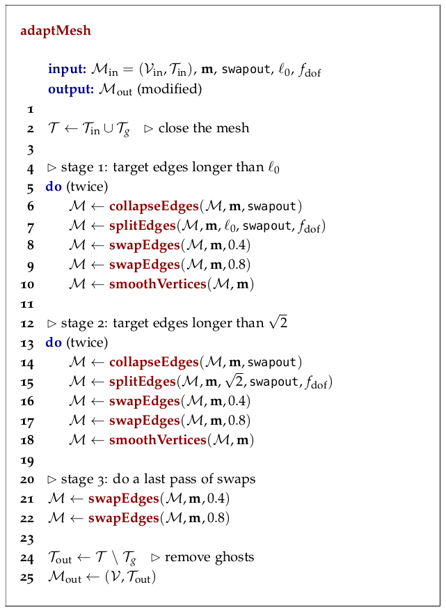

# The remeshing algorithm

Among Tucanos features is the remeshing algorithm whose goal is to perform operations on the current mesh to inforce *as best as possible* the desired metric. The objective is to have a mesh that is close to unitary with respect to the prescribed metric. 

Practically, if the metric is not defined on the vertices of the mesh, it is interpolated on them using embedded functions from tucanos. Following that, local operations are performed on mesh entities within *cavities* (list of geometrical entities containing the entity). Different local operators exists such as *edge splits, edge collapses, edge swaps, vertex smoothing etc* (Caplan, 2020). Cavity operators function is to replace an existing set of elements by a new one that conserves mesh topology (for example there is no face $F$ counted twice). Each local operation is performed if it prescribes edge lengths and element qualities that are quasi-unit. The order of these operations is performed as in the scheduler described in Caplan's PhD (see Figure below). The scheduler is expected to have a significant impact on the outputted mesh. It is believed to be the major source of difference between existing metric-based remeshers such as MMG (mmg), fefloa (Loseille, 2017) or refine (refine).

> **Figure 1:** *Mesh adaptation scheduling algorithm (Caplan, 2020)*