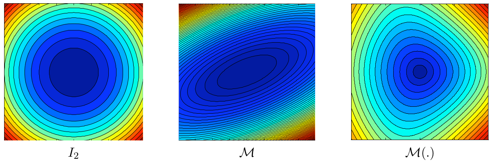
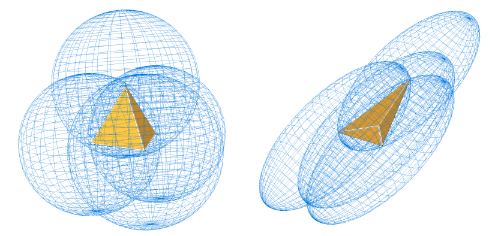
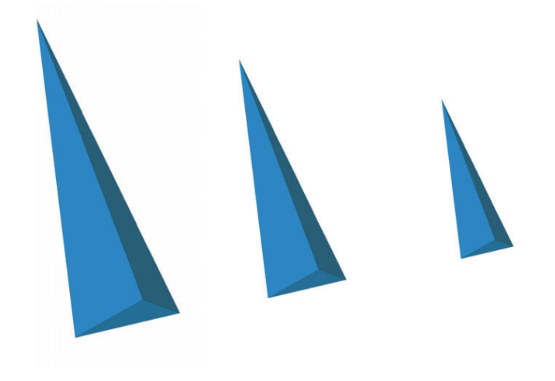
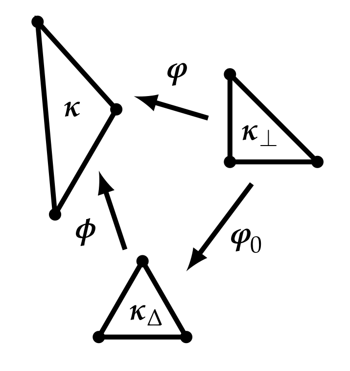

# Riemannian metrics

## Riemannian metric space

A Riemannian metric space $(\mathcal{R}^d, \mathcal{M}(\mathbf{x}))$ is defined by a continuous metric field $\mathcal{M}(\cdot)$ in $\mathcal{R}^d$. The **length** of an edge $\mathbf{ab}$ is computed using the path $\gamma(t)=\mathbf{a}+t\mathbf{ab}$ where $t\in[0,1]$:

$$l_\mathcal{M}(\mathbf{ab})=\int_0^1||\gamma^{'}(t)||dt=\int_0^1\sqrt{\mathbf{ab}^{\top}\mathcal{M}(\mathbf{a}+t\mathbf{ab})\mathbf{ab}}dt$$

The figure below shows length computation in different metric spaces. We see that the iso-values of distance in the Riemannian space are "distorted" with the loss of symmetry when compared to the Euclidean spaces.

> **Figure 1:** *Iso-values of the distance w.r.t canonical Euclidean space (left), euclidean space defined by $\mathcal{M}$ and Riemannian space defined by $\mathcal{M}(\cdot)$ (loseille 2008)*

Given a bounded subset $K$ of $\mathbb{R}^d$, the volume $|K|_{\mathcal{M}(\cdot)}$ is given by:

$$|K|_{\mathcal{M}(\cdot)}=\int_K\sqrt{\text{det}\mathcal{M(\mathbf{x})}}d\mathbf{x}$$

### Unit elements and meshes

Let $K$ be a simplex element in $\Omega\subset\mathbb{R}^n$ where $n$ denotes its dimension. $K$ is unit w.r.t the euclidean metric field $\mathcal{M}$ when all its edges are equal to 1 in this metric. Mathematically speaking, if we define the list of edges of $K$ by $(\mathbf{e}_i)_{i=1,n(n+1)/2}$, then

$$\forall i=1,...,\frac{n(n+1)}{2}, \quad l_{\mathcal{M}}(\mathbf{e}_i)=1$$

And, the volume of $K$ is given by:

$$|K|_{\mathcal{M}}=\frac{\sqrt{n+1}}{2^{n/2}n!} \text{ and } |K|_{\mathcal{I}_n}=\frac{\sqrt{n+1}}{2^{n/2}n!}\text{det}(\mathcal{M}^{-\frac{1}{2}})$$

> **Figure 2:** *Geometric representation of unit tetrahedrons in metric $\mathcal{I}_3$ (left) and an anisotropic metric $\mathcal{M}$ (right) (loseille 2008)*

The metric $\mathcal{M}$ for which $K$ is unit is unique and referred to as the *implied metric* of $K$. Conversely, when given a metric $\mathcal{M}$, the set of unit elements is not empty. Similarly, the unit notion can be extended to a mesh composed of simplexes with a continuous metric field $\mathcal{M}(\cdot)$. The mesh could then be said unit, if all its simplex elements are unit in $\mathcal{M}(\cdot)$. However, it is well known that the equilateral tetrahedron does not fill a subset $\Omega$ of $\mathbb{R}^3$. Following the proposition in the literature (Loseille 2011), the unit notion for simplex elements is relaxed to the quasi-unit element notion. $K$ is said to be **quasi-unit** if:

$$\forall i=1,...,\frac{n(n+1)}{2}, \quad l_{\mathcal{M}}(\mathbf{e}_i)\in\left[\frac{1}{\sqrt{2}}, \sqrt{2}\right]$$

Yet, some examples show that elements with a null volume (i.e. degenerated elements) can satisfy the above property. The authors propose a strategy to control the ratio between the volume $|K|_{\mathcal{M}}$ and the sum of the square length of the edges $l_{\mathcal{M}}^2(\mathbf{e}_i)$. This ratio defines the quality function $\mathcal{Q}_{\mathcal{M}}$ that measures the proximity of $K$ to the perfectly unit element in $\mathcal{M}$:

$$\mathcal{Q}_{\mathcal{M}}(K)=\frac{n(n!)^{2/n}}{(n+1)^{\frac{1-n}{n}}} \frac{|K|_{\mathcal{M}}^{\frac{2}{n}}}{\sum_{i=1}^{\frac{n(n+1)}{2}} l_{\mathcal{M}}^2(\mathbf{e}_i)} \in [0,1]$$

The constant $\frac{n(n!)^{2/n}}{(n+1)^{\frac{1-n}{n}}}$ is chosen so that $\mathcal{Q}_{\mathcal{M}}$ is equal to 1 when $K$ is perfectly unit in $\mathcal{M}$. For a null volume $\mathcal{Q}_{\mathcal{M}}$ is 0. A constraint on the quality is added to the definition of **quasi-unit** element to avoid describing degenerated elements.

Then, $K$ is said to be **quasi-unit** if:

$$\forall i=1,...,\frac{n(n+1)}{2}, \quad l_{\mathcal{M}}(\mathbf{e}_i)\in\left[\frac{1}{\sqrt{2}}, \sqrt{2}\right] \quad \text{ and } \quad \mathcal{Q}_{\mathcal{M}}(K) \in [\alpha,1] \text{ with } \alpha>0$$

Finally, the simplex mesh $\mathcal{T}_h$ is said unit with respect to the metric field $(\mathcal{M}(\mathbf{x}))_{\mathbf{x}\in\Omega}$ when all its elements are **quasi-unit** in $(\mathcal{M}(\mathbf{x}))_{\mathbf{x}\in\Omega}$. This defines the duality between the discrete and continuous mesh, in the sense that, given a metric field there exists a unit mesh with respect to that metric field $(\mathcal{M}(\mathbf{x}))_{\mathbf{x}\in\Omega}$.

### Complexity

We define the complexity $\mathcal{C}$ of metric field $(\mathcal{M}(\mathbf{x}))_{\mathbf{x}\in\Omega}$:

$$\mathcal{C}(\mathcal{M}(\cdot))=\int_{\Omega}\sqrt{\text{det}(\mathcal{M}(\mathbf{x}))}d\mathbf{x}$$

This real value parameter is useful to quantify the global level of accuracy of $(\mathcal{M}(\mathbf{x}))_{\mathbf{x}\in\Omega}$. It can also be interpreted as the continuous counterpart of the number of vertices of a discrete mesh. There is a direct relationship between the prescribed metric complexity and the number of elements of the generated mesh. Let $\mathcal{T}_h$ be a simplex mesh of $\Omega\subset\mathbb{R}^d$ composed of simplex elements $K$. We can describe this mesh with the metric $\mathcal{M}(\mathbf{x})_{\mathbf{x}\in\Omega}$ in which $\mathcal{T}_h$ is unit. Then, the continuous mesh complexity and the mesh number of element $N_{elts}$ are linked using the unit element properties:

$$\mathcal{C} \approx \sum_{K} \sqrt{\text{det}\mathcal{M}} |K| \approx \sum_{K} \frac{\sqrt{d+1}}{2^{d/2}d!} = \frac{\sqrt{d+1}}{2^{d/2}d!} N_{elts}$$

After remeshing, this relation is not exact because most of the elements are not perfectly unit.

### Embedded Riemannian spaces

Two embedded Riemannian spaces have the same anisotropic ratios and orientations. They differ only from their complexity. Mathematically speaking, two Riemannian spaces $(\mathcal{M}(\mathbf{x}))_{\mathbf{x}\in\Omega}$ and $(\mathcal{N}(\mathbf{x}))_{\mathbf{x}\in\Omega}$ are embedded if a constant $c$ exists such that:

$$\forall \mathbf{x}\in\Omega, \quad \mathcal{N}(\mathbf{x})=c\mathcal{M}(\mathbf{x})$$

Conversely, from $\mathbf{M}=(\mathcal{M}(\mathbf{x}))_{\mathbf{x}\in\Omega}$ we can deduce $\mathbf{N}=(\mathcal{N}(\mathbf{x}))_{\mathbf{x}\in\Omega}$ of complexity $N$ having the same anisotropic properties (anisotropic orientations and ratios) by considering:

$$\mathcal{N}(\mathbf{x})=\left(\frac{N}{\mathcal{C}(\mathbf{M})}\right)^{\frac{2}{3}}\mathcal{M}(\mathbf{x})$$

In the context of error estimation, this notion enables convergence order study with respect to an increasing complexity $N$. Consequently, the complexity $\mathcal{C}(\mathbf{M})$ is also the continuous counterpart of the classical parameter $h$ used for uniform meshes while studying convergence.

> **Figure 3:** *Different unit elements where only the density increases from left to right. (losei 2008)*

### Local decomposition of the metric field in $\mathbb{R}^n$

Let $\mathcal{M}(\mathbf{x})$ be a metric defined locally on point $\mathbf{x}$ of domain $\Omega\subset\mathbb{R}^n$. Then, by definition, this metric can be written in diagonal form yielding:

$$
\begin{aligned}
    \mathcal{M}(\mathbf{x}) &= \mathcal{R}^{\top}(\mathbf{x})\begin{pmatrix} \lambda_1(\mathbf{x}) & & \\ & \ddots & \\ & & \lambda_d(\mathbf{x}) \end{pmatrix} \mathcal{R}(\mathbf{x}) \\
    &= \mathcal{R}^{\top}(\mathbf{x})\begin{pmatrix} h_1^{-2}(\mathbf{x}) & & \\ & \ddots & \\ & & h_n^{-2}(\mathbf{x}) \end{pmatrix} \mathcal{R}(\mathbf{x})
\end{aligned}
$$

In this form, the optimal orientations are given by the rotation matrix $\mathcal{R}(\mathbf{x})$ and the sizes are given by $h_i(\mathbf{x})$, given by the eigenvalues $\lambda_i^{-\frac{1}{2}}(\mathbf{x})$. However, we want to write a form that locally decouples the anisotropic information from the global size. Following (Loseille 2011b), the following local parameters can be defined:

* Anisotropic quotients $r_i$ defined as:

$$
r_i = h_i\left(\prod_{k=1}^n h_k\right)^{-\frac{1}{n}}
$$

* A density $d$ defined as:

$$
d = \left(\prod_{k=1}^n \lambda_k\right)^{\frac{1}{2}} = \left(\prod_{k=1}^n h_k\right)^{-1}
$$

Locally, the metric writes:

$$
\mathcal{M}(\mathbf{x}) = d^{\frac{2}{n}}(\mathbf{x})\mathcal{R}^{\top}(\mathbf{x})\begin{pmatrix} r_1^{-2}(\mathbf{x}) & & \\ & \ddots & \\ & & r_n^{-2}(\mathbf{x}) \end{pmatrix} \mathcal{R}(\mathbf{x})
$$

This decomposition is used in the Hessian scaling technique described in the section on Hessian Scaling.

### Geometric invariants for unit elements

Unit element's geometric properties can be connected to the linear algebra properties of metric tensors thanks to geometric invariants:

  * Invariant related to the Euclidean volume $|K|$:
    $$|K|=\frac{\sqrt{3}}{4}\text{det}(\mathcal{M}^{-\frac{1}{2}}) \text{ in 2D and } |K|=\frac{\sqrt{2}}{12}\text{det}(\mathcal{M}^{-\frac{1}{2}}) \text{ in 3D.}$$

  * Invariant related to the square length of the edges for all symmetric matrix $H$:

    $$
    \begin{aligned}
    \sum_{i=1}^3 \mathbf{e}_i^{\top}H\mathbf{e}_i &= \frac{3}{2}\text{tr}(\mathcal{M}^{-\frac{1}{2}}H\mathcal{M}^{-\frac{1}{2}}) \text{ in 2D,} \\
    \sum_{i=1}^6 \mathbf{e}_i^{\top}H\mathbf{e}_i &= 2\text{tr}(\mathcal{M}^{-\frac{1}{2}}H\mathcal{M}^{-\frac{1}{2}}) \text{ in 3D,}
    \end{aligned}
    $$

### Element-implied metric computation

Practically we compute the *implied metric* $\mathcal{M}_K$ by first computing $\mathcal{M}_K^{-\frac{1}{2}}$ from a two-step transformation. Let $\mathbf{\varphi}_0$ be the jacobian transformation matrix from $K_{\perp}$ to $K_{\Delta}$ and $\mathbf{\varphi}$ be the jacobian transformation matrix from $K_{\perp}$ to $K$.

We use the triangle mapping definition to compute $\mathbf{\varphi}_0$ and $\mathbf{\varphi}$. The element-implied metric becomes:

$$\mathcal{M}_K = (\mathbf{\Phi}\mathbf{\Phi}^{\top})^{-1} = (\mathbf{\varphi}\mathbf{\varphi}_0^{-1} \mathbf{\varphi}_0^{-\top}\mathbf{\varphi}^{\top})^{-1}$$

> **Figure 4:** *Relationship between the physical $K$ and reference elements ($K_{\Delta}$ and $K_{\perp}$ ) for the calculation of the element-implied metric. (CAPLAN2020102915)*

### Numerical computation of lengths

Let $\mathbf{a}$ and $\mathbf{b}$ be two points of the domain. The length of segment $\mathbf{ab}$ can be numerically approximated using a $k$-points Gaussian quadrature with weights $(\omega_i)_{i=1...k}$ and barycentric coefficients $(\alpha_i)_{i=1...k}$:

$$l_{\mathcal{M}}(\mathbf{ab})=\int_0^1\sqrt{\mathbf{ab}^{\top}\mathcal{M}(\mathbf{a}+t\mathbf{ab})\mathbf{ab}}dt \approx \sum_{i=1}^k\omega_i\sqrt{\mathbf{ab}^{\top}\mathcal{M}(\mathbf{a}+\alpha_i\mathbf{ab})\mathbf{ab}}$$

where $\mathcal{M}(\mathbf{a}+\alpha_i\mathbf{ab})$ is the metric at the $i^{th}$ Gauss point. In the context of meshing, we are interested in the evaluation of edge length in the metric. This is a recurrent operation which could be time consuming for the mesh generator. Fortunately, this operation is at the edge level where the metric is known at the endpoints. The problem can thus be simplified by considering a variation law of the metric along the edge and computing analytically the edge length in the metric.

Formally speaking, let $\mathbf{e}=\mathbf{p_1p_2}$ be an edge of the mesh of Euclidean length $||\mathbf{e}||_2$, and $\mathcal{M}(\mathbf{p_1})$ and $\mathcal{M}(\mathbf{p_2})$ be the metrics at the edge extremities $\mathbf{p_1}$ and $\mathbf{p_2}$. We denote by $l_i(\mathbf{e})=\sqrt{\mathbf{e}^{\top}\mathcal{M}(\mathbf{p_i})\mathbf{e}}$ the length of the edge in metric $\mathcal{M}(\mathbf{p}_i)$. We assume $l_1(\mathbf{e})>l_2(\mathbf{e})$ and we set $a=\frac{l_1(\mathbf{e})}{l_2(\mathbf{e})}$.

Now, we consider the metric variation law associated with the interpolation operator on metrics. 

Logarithmic interpolation is used to interpolate between metrics:
$$ \mathcal M(t) = \exp\{(1 - t)  \log(\mathcal M_0) + t \log(\mathcal M_1)\}$$
as it verifies a maximum principle, i.e. if $\det(\mathcal M_0) \le \det(\mathcal M_1)$ then $\det(\mathcal M_0) \le \det(\mathcal M(t)) \le \det(\mathcal M_1)$ for $0 \le t \le 1$

When interpolating a discrete metric field at $\mathbf x = \sum \alpha_i \mathbf x_i$ is approximated as
$$ \mathcal M(\mathbf x) = \exp\left(\sum \alpha_i \log(\mathcal M_i)\right)$$
which is consistent with the assumption of geometric progression of sizes.

#### Why not linear interpolation?

 

Linear interpolation between $\mathcal M_0$ and $\mathcal M_1$ is given by
$$ \mathcal M(t) = (1 - t)  \mathcal M_0 + t \mathcal M_1$$
and does not respect the maximum principle.

As such, logarithmic interpolation is considered along the edge. It can be shown that it is equivalent to a geometric interpolation of the physical length prescribed by the metric [F. Alauzet](https://www.ljll.fr/~frey/papers/meshing/Alauzet%20F.,%20Size%20gradation%20control%20of%20anisotropic%20meshes.pdf), leading to the following Riemannian distance computation:

$$l_{\mathcal{M}}(\mathbf{e})=l_1(\mathbf{e})\frac{a-1}{a\text{ln}(a)}$$

### Numerical computation of volumes

The evaluation of a tetrahedron volume in a Riemannian metric space consists in computing the volume integral numerically. If a first order approximation in the log-Euclidean framework is considered, we get:

$$|K|_{\mathcal{M}}=\int_{K}\sqrt{\text{det}\mathcal{M}}d\mathbf{x}\approx\sqrt{\text{det}\left( \text{exp}\left(\frac{1}{4}\sum_{i=1}^4\text{log}(\mathcal{M}_i)\right)\right)}|K|_{\mathcal{I}_3}$$

Higher order approximation can be obtained by using Gaussian quadrature. For instance, if one considers a $k$-point Gaussian quadrature with weights $(\omega_j)_{j=1...k}$ and barycentric coefficients $(\beta_j^1,\beta_j^2,\beta_j^3,\beta_j^4)_{j=1...k}$, it yields:

$$|K|_{\mathcal{M}}\approx|K|_{\mathcal{I}_3}\sum_{j=1}^k\omega_j\sqrt{\text{det}\left( \text{exp}\left(\sum_{i=1}^4\beta_j^i\text{log}(\mathcal{M}_i)\right)\right)}$$

